```{r xaringan-banner, echo=FALSE}
xaringanExtra::use_banner(
  bottom_left = "Data-mining And Multivariate-regression",
  exclude = "title-slide"
)
```


```{r xaringan-tile-view, echo=FALSE} 
xaringanExtra::use_tile_view()
```

```{r xaringan-webcam, include = FALSE}
xaringanExtra::use_webcam()
```


```{r setup, include=FALSE}
options(htmltools.dir.version = FALSE)
```

```{r echo = FALSE}
# remotes::install_github("gadenbuie/xaringanExtra")
xaringanExtra::use_panelset()
```

```{r xaringan-editable, include = FALSE}
xaringanExtra::use_editable()
```

```{r xaringan-animate-css, echo=FALSE}
xaringanExtra::use_animate_css()
```

---
class: middle,center
# Before Bagging 

---
## Resampling

- Evaluate the learning effect from data: the generalization performance.

--

- Just based on data: good performance in this data but not in others.

--

- **Validation Approach**: splitting training set into training set and validation set(or hold set).**it always causes a positive estimate**.

--

- **Re-sampling methods** provide an alternative approach by allowing us to repeatedly fit a model of interest to parts of the training data and test its performance on other parts. 

--

### The Advantage of Bootstrap

- Since observations are replicated in bootstrapping, there tends to be less variability in the error measure compared with k-fold CV(cross validation).

---

## Bootstrap

- A bootstrap sample is a random sample of the data taken with replacement 

- A bootstrap sample is the same size as the original data set from which it was constructed.


---

class: middle
## Bootstrap with code

---


.panelset[
 .panel[.panel-name[Python Code]
````python
import numpy as np
np.random.seed(123)
pop = np.random.randint(0,500 , size=1000)
sample = np.random.choice(pop, size=300) #so n=300
sample_mean = []
for _ in range(10000):  #so B=10000
    sample_n = np.random.choice(sample, size=300)
    sample_mean.append(sample_n.mean())
import matplotlib.pyplot as plt
plt.hist(sample_mean)
```
]
.panel[.panel-name[Plot]
```{r,echo=FALSE}
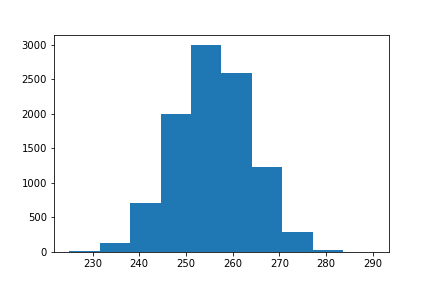
```

]
]


---

.panelset[
 .panel[.panel-name[R Code]

Resample one time 
```r
library(rpart)
library(MASS)
data(Pima.tr) ## load data
Diabetes <- Pima.tr[,8] ## response
X <- Pima.tr[,-8] ## predictor
tree <- rpart(Diabetes ~ ., data=X,
control=rpart.control(xval=10))) ## 10-fold CV
n <- nrow(X)
subsample <- sample(1:n, n , replace=TRUE)
sort(subsample)
tree_boot <- rpart(Diabetes ~ ., data=X, subset=subsample,
control=rpart.control(xval=10))) ## 10-fold CV
```
]
  .panel[.panel-name[Plot]
  
- Doing this twice, we get the two following trees, each fitted on a different
(random) subset of the data.
  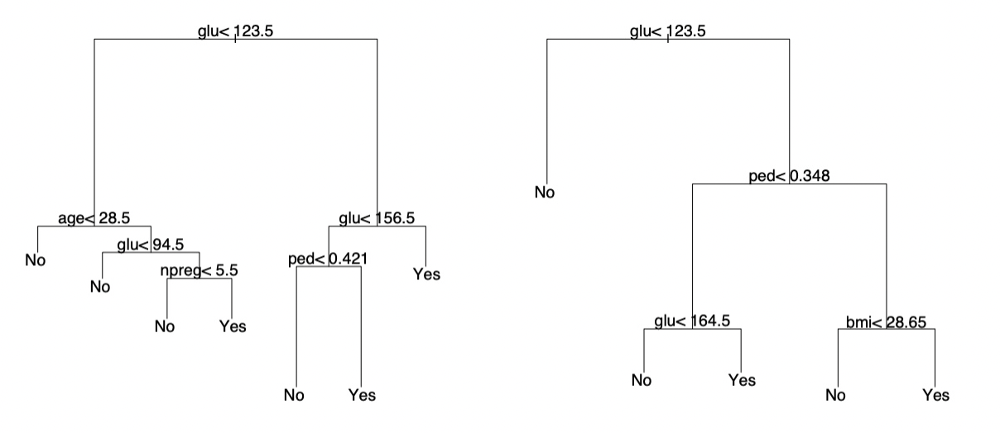
  ]
]


---

## Bagging(from *B*ootstrap *Agg*regat*ing*)
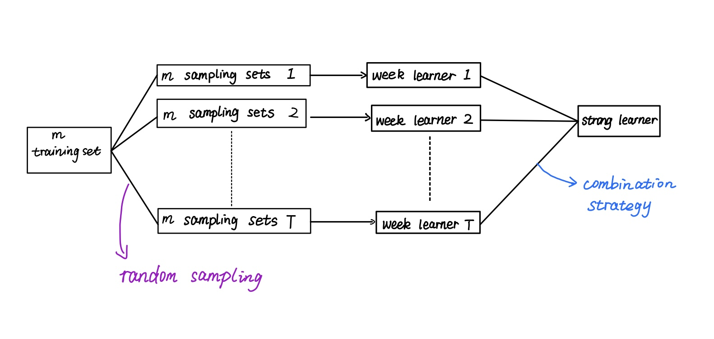

---

### Definition 


- Bootstrap aggregating (Bagging) prediction models is a general method for fitting multiple versions of a prediction model and then combining (or ensembling) them into an aggregated prediction

--

- Bagging is a fairly straight forward algorithm in which b Bootstrap copies of the original training data are created

--

- New predictions are made by averaging the predictions together from the individual base learners.

$$\widehat{f(X_{bag})}=\widehat{f_1(X)}+\widehat{f_2(X)}+\cdots+\widehat{f_b(X)}$$
- the $\widehat{f(X_{bag})}$ is bagged prediction.

- The $\widehat{f_1(X)},\widehat{f_2(X)},\cdots,\widehat{f_b(X)}$ are the predictions from the individual base learners.

- Bagging does not always improve upon an individual base learner.

- Bagging works especially well for unstable, high variance base learners

---

## Algorithm

Bagging Tree has the following algorithm. Let $\hat Y$ be a tree(or other predictor) based on samples $(X_1,Y_1),\cdots,(X_n,Y_n)$

--

- Draw indices $(j_1,\cdots,j_n)$ from the set $\{1,\cdots,n\}$ with replacement. Fit the tree $\hat{Y^*}$ based on samples

$$(X_{j1},Y_{j1}),\cdots,(X_{jn},Y_{jn})$$
--

- Repeat first step B times to obtain 
$$\hat Y^{*,1},\cdots,\hat Y^{*,B}$$

--

- Bagged estimator is 
$$\hat Y_{bag}=\frac{1}{B}\sum_{b=1}^B\hat Y^{*,b}$$

---

### The Thought in Bagging

- for $B\to \infty$(many bootstrap samples)
$$\tilde Y_{Bag}\to E(\hat {Y})$$


- the aggregation of information in large diverse groups results in decisions that are often better than could have been made by any single member of the group. 

- Empirically, Bagging seems to reduce the variance of $\hat{Y}$ e.g.

$$E((\hat Y-E[\hat Y])^2)\geq E((\hat Y_{Bag}-E[\hat{Y_{Bag}}])^2)$$

---

## Proof the conclusion in math
Using $\widetilde Y_{Bag}\to E(\hat Y)$ for $B\to \infty$

$$E((\hat Y-E[\hat Y])^2)=E[(Y-\widetilde Y_{Bag}+\widetilde Y_{Bag}-\hat Y)^2]
\\=E[(Y-\widetilde Y_{Bag})]^2+E[(\widetilde Y_{Bag}-\hat Y)^2]
\\\geq E((\hat Y_{Bag}-E[\hat{Y_{Bag}}])^2)$$

the population bagging estimatoe $\widetilde Y_{Bag}$ thus reduced the squared error loss by eliminating the variance of $\hat Y$ around its mean $E(\hat Y)$


- For trees, this means that bagging has a very beneficial effect on trees with a large size.


---
class: middle,center,inverse
# The Comparison with different depths 

---

Generating a tree with depth of  $d=1$

```{r,echo=FALSE,out.width='65%',out.height='65%',fig.align='center'}
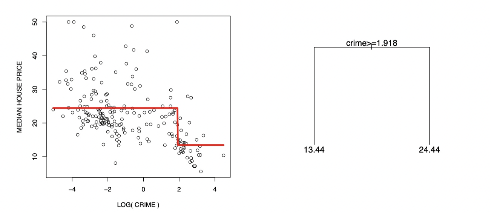
```

Bagged stumps $\hat Y^{*,b},b=1,2,\cdots,10$


```{r,echo=FALSE,out.width='65%',out.height='65%',fig.align='center'}
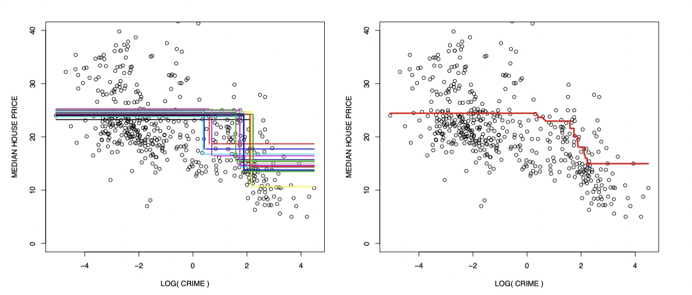
```

Bagging leads to a small but not a dramatic improvement.

---

### The Depth $d=3$
The fit with depth $d=3$ have a poor performance 

```{r,echo=FALSE,out.width='65%',out.height='65%',fig.align='center'}
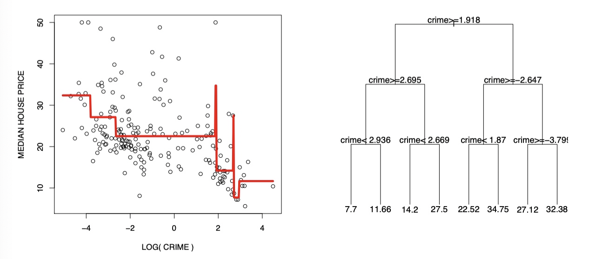
```

$\hat Y$ has a high variance(and low bias), bagging leads to a large improvement.

```{r,echo=FALSE,out.width='65%',out.height='65%',fig.align='center'}
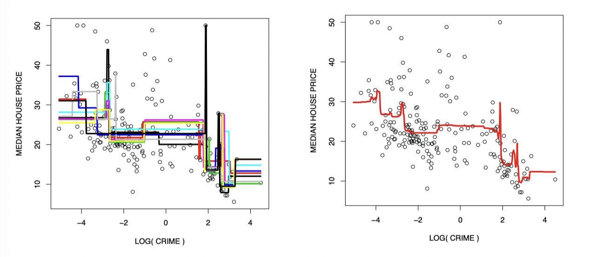
```

---
class: middle,inverse
## Out of Bag test error estimation

---
### Out of Bag demonstration 


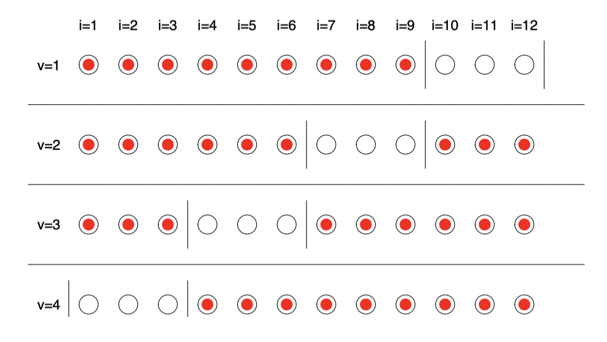

for each $v=1,\cdots,V$
- fit $Y_{Bag}$ on the training samples,shown as red dots.
- predicts with this tree the left-out test observations, shown as white dots.

---


Fit $Y_{Bag}$ we construct the $V\times B$ fits on which the origional trees.


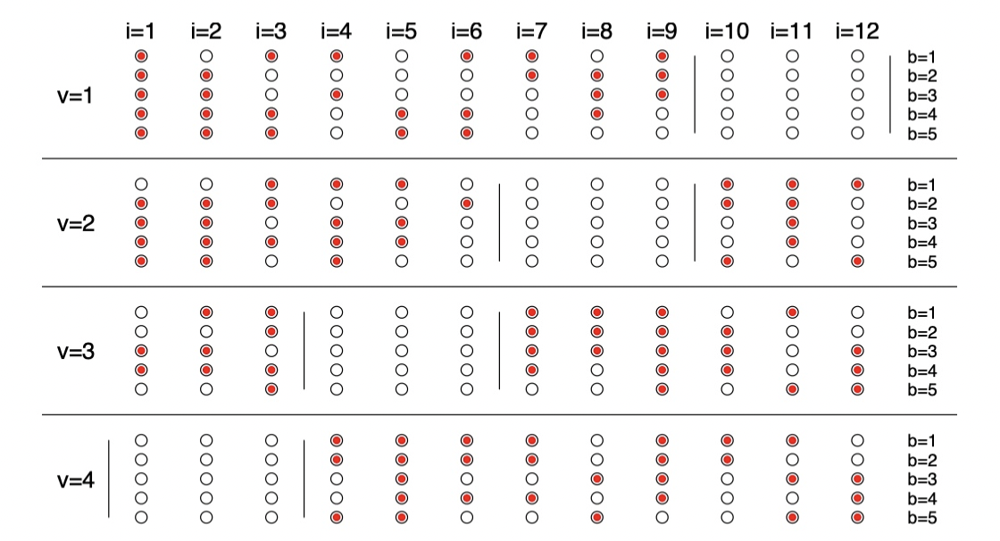

--

- the computation is expensive.


--
- The core idea: test on the “unused” data points in each bootstrap iteration to estimate test error.


---

class: middle
To answer this question, we need again a good approximation to the test error (here for the squared error loss function L)
$$R_{test}:=E(L(Y,\hat Y_{Bag}))$$
--

If fitting B bootstrap estimates $\hat Y^{*,b}$, to assess the prediction for $i=1$, average only over such b, where observation $i=1$ has not been used in fitting $\hat Y^{*,b}$.

--

Recall that, for B bootstrap samples $\hat Y^{*,b}$, the bagged estimator at observation $i$ is given by $\hat Y_i:=\hat Y_{Bag}(X_i)$

$$\hat Y_i=\frac{1}{B}\sum_{b\in \{1,\cdots,B\}}Y^{*,b}(X_i)$$
---

class: middle
Instead, let now 
$$\hat Y_i^{obb}=\frac{1}{|\widetilde B_i|}\sum_{b\in \widetilde B_i}Y^{*,b}(X_i)$$
where the sum is only taken over the set
$$\widetilde B_i=\{b:X_i \notin trainingset \}\subseteq \{1,\cdots,B\}$$
--

The estimate of the error is then computed, as usual,by

$$\hat R_{test}=\frac{1}{n}\sum_{i=1}^nL(Y_i,\hat Y_i^{oob})$$

---

### The Relation Between $|\widetilde B_i|$ and B
the probablity $\pi^{obb}$ of an observation NOT being included in a bootstrap sample $(j_1,\cdots,j_n)$ (and hence called out-of-bag)is, as all $j_k$ for $k=1,\cdots,n$ are drawn with replacement from $\{1,\cdots,n\}$

$$\pi^{obb}=\prod_{i=1}^n(1-\frac{1}{n})^n\stackrel{n\to \infty }{\longrightarrow} exp(-1)\approx 0.367$$


Hence, $E(|\widetilde B_i|)=exp(-1)\cdot B\approx 0.367B$ ,
for all $i=1,\cdots,n$


---
class: center,inverse,middle
# Bagging Implement 

---

### Algorithm in `Python`
```python
class Bagging:
     def __init__(self, base_learner, n_learners):
        self.learners = [clone(base_learner) for _ in range(n_learners)]

     def fit(self, X, y):
         for learner in self.learners:
             examples = np.random.choice(
                 np.arange(len(X)), int(len(X)), replace=True)
             learner.fit(X.iloc[examples, :], y.iloc[examples])
             
     def predict(self, X):
         preds = [learner.predict(X) for learner in self.learners]
         return np.array(preds).mean(axis=0) 
# in an easy way to use the algorithm
from sklearn.ensemble import BaggingClassifier
```


---
class:center
## Computing Out-of-Bag Estimation

---

### using `R`
.panelset[
  .panel[.panel-name[R Code]
```r
n <- nrow(Boston)
X <- Boston[,-14]
Y <- Boston[,14]
maxdepth<- 10 # plot the depth d = 3 and d = 5
tree <- rpart(Y ~.,data = X,
              control = rpart.control(maxdepth = maxdepth,minsplit = 2))
plot(tree,margin=.1,uniform=TRUE);text(tree,cex=1.3)
```
  ]
  .panel[.panel-name[Plot]
plot Trees of depth $d= 3$ and $d=5$

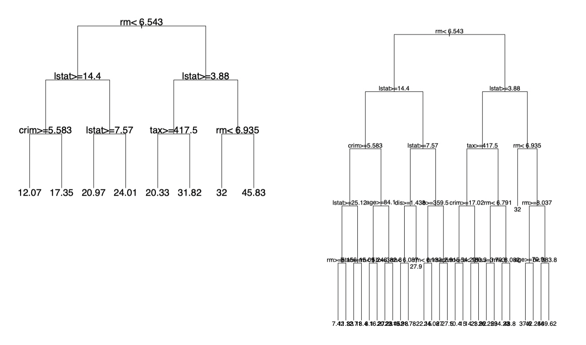
]]


---

.panelset[
  .panel[.panel-name[R Code]
```r
B <- 100
prediction_oob <- rep(0,length(Y)) ## vector with oob predictions
numbertrees_oob <- rep(0,length(Y)) ## how many oob trees
for (b in 1:B){ ## loop over bootstrap samples
  subsample <- sample(1:n,n,replace=TRUE) ## "in-bag" samples
  outofbag <- (1:n)[-subsample] ## "out-of-bag" samples ## fit tree on "in-bag" samples
  treeboot <- rpart(Y ~ ., data=X, subset=subsample,
                    control=rpart.control(maxdepth=maxdepth,minsplit=2))
  ## predict on oob-samples
  prediction_oob[outofbag] <- prediction_oob[outofbag] +
    predict(treeboot, newdata=X[outofbag,])
  numbertrees_oob[outofbag] <- numbertrees_oob[outofbag] + 1
}
## final oob-prediction is average across all "out-of-bag" trees
prediction_oob <- prediction_oob / numbertrees_oob
plot(prediction_oob, Y, xlab="PREDICTED", ylab="ACTUAL")
df<-as.data.frame(cbind(prediction_oob,Y))
ggplot(data=df,aes(prediction_oob,Y))+
  geom_point(aes(prediction_oob,Y))+
  geom_smooth(method = 'lm',formula = y ~ x, se = F)
```
  ]
  .panel[.panel-name[Plot]
  
```{r,echo=FALSE}
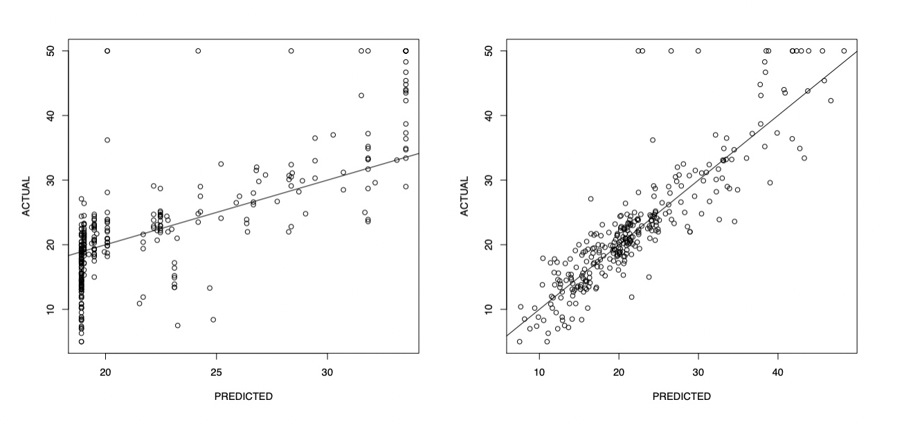
```
  ]
]

---

class: middle
## Python
```python
# import relative packages
from sklearn import datasets,tree
import numpy as np
import matplotlib.pyplot as plt
from sklearn.model_selection import StratifiedShuffleSplit, GridSearchCV, cross_val_score
from sklearn.ensemble import BaggingClassifier

```

---

.panelset[
  .panel[.panel-name[Python Code]
```python
X, y = datasets.make_moons(n_samples=500, noise=0.3, random_state=42)
plt.scatter(X[y == 0, 0], X[y == 0, 1])
plt.scatter(X[y == 1, 0], X[y == 1, 1])
plt.show()
bagging_clf = BaggingClassifier(DecisionTreeClassifier(),
                                n_estimators=500,
                                max_samples=100,
                                bootstrap=True,
                                oob_score=True)
bagging_clf.fit(X, y)
bagging_clf.oob_score_ # the bagging obb score 
clf = RandomForestClassifier(random_state=0, oob_score=True)
clf.fit(X, y)  
print(clf.oob_score_) # the RF obb score
cv = StratifiedShuffleSplit(n_splits=10, test_size=0.1, random_state=42)
clf = tree.DecisionTreeClassifier(criterion='entropy', random_state=42)
score = cross_val_score(clf, X, y, cv=cv).mean()
print(score) #the cv score by ID3
clf = tree.DecisionTreeClassifier(criterion='gini', random_state=42)
score = cross_val_score(clf,X, y, cv=cv).mean()
print(score) # the cv score by CART
```
]
.panel[.panel-name[Output]
```{r,echo=FALSE,fig.align="left"}
df<-data.frame(c(0.916,0.9,0.854,0.858),row.names = c("Bagging","RF","ID3","CART"))
knitr::kable(df,col.names = "obb scores")
```
]
]


---

class: middle
- Decision tree is unstable, linear regression is stable
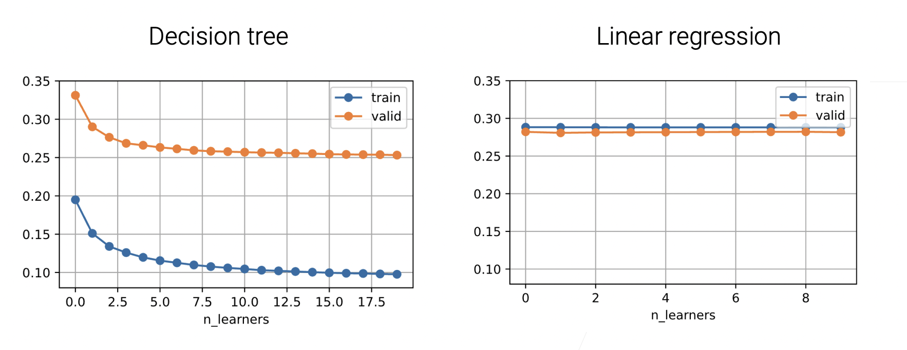

---
# References
- Efron, Bradley, and Robert Tibshirani. 1986. “Bootstrap Methods for Standard Errors, Confidence Intervals, and Other Measures of Statistical Accuracy.” Statistical Science. JSTOR, 54–75.

- Therneau, Terry M, Elizabeth J Atkinson, and others. 1997. “An Introduction to Recursive Partitioning Using the RPART Routines.” Mayo Foundation.

- https://c.d2l.ai/stanford-cs329p/

- http://www.stats.ox.ac.uk/~teh/datamining.html

- https://bradleyboehmke.github.io/HOML/bagging.html

- https://en.wikipedia.org/wiki/Bootstrapping_(statistics)

- https://en.wikipedia.org/wiki/Bootstrap_aggregating

---

background-image: url('george.jpg')
background-size: cover


---

class: middle,center
# Thank you for your watching!


